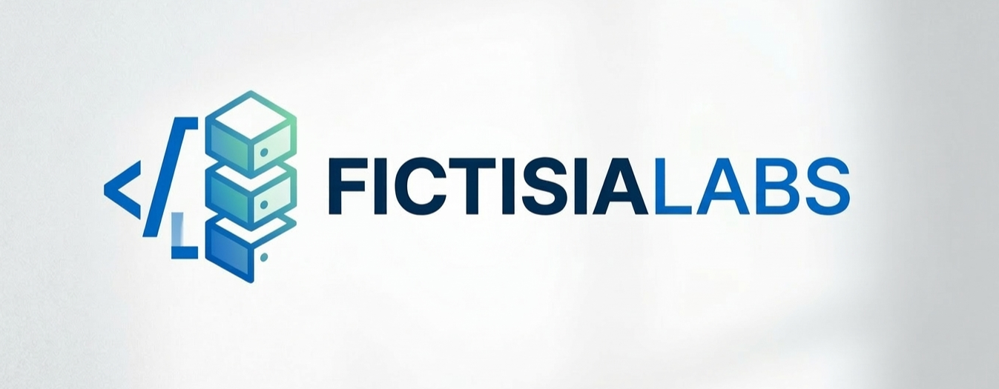

  

<h1 align="center">Fictisia Labs</h1>

**Fictisia Labs** é uma organização fictícia criada para o desenvolvimento, experimentação e demonstração de projetos de engenharia de software modernos. A iniciativa tem como propósito estruturar projetos de forma profissional, simulando o funcionamento real de uma empresa de tecnologia que desenvolve plataformas digitais, APIs, ferramentas para desenvolvedores e sistemas escaláveis.

A organização existe como um ambiente de construção de soluções tecnológicas bem estruturadas, onde cada projeto representa um produto ou componente de uma plataforma maior.

---

# Finalidade

A finalidade da Fictisia Labs é servir como um laboratório de engenharia de software onde diferentes conceitos de arquitetura, desenvolvimento e infraestrutura podem ser aplicados de forma organizada e consistente.

Dentro da organização são desenvolvidos:

- APIs e serviços backend
- aplicações web
- bibliotecas reutilizáveis
- ferramentas para desenvolvedores
- plataformas SaaS
- sistemas baseados em arquitetura modular
- experimentos de arquitetura escalável

Cada projeto busca refletir boas práticas utilizadas em ambientes profissionais de engenharia de software.

---

# Objetivo

O objetivo principal da Fictisia Labs é construir um ecossistema de projetos interligados que demonstrem:

- organização de código em larga escala
- padronização de arquitetura
- consistência entre diferentes sistemas
- documentação clara e estruturada
- práticas modernas de desenvolvimento

A organização também busca demonstrar conceitos como:

- arquitetura limpa
- separação de responsabilidades
- modularização de sistemas
- desenvolvimento orientado a serviços
- integração entre diferentes aplicações

---

# Sentido de Existir

A Fictisia Labs existe para representar uma estrutura de desenvolvimento semelhante à de empresas de tecnologia reais, permitindo que projetos sejam desenvolvidos dentro de um contexto maior, onde cada sistema possui um papel dentro de um ecossistema.

Ao invés de projetos isolados, a organização promove a construção de soluções que podem se conectar entre si, formando uma plataforma tecnológica mais ampla.

Esse modelo permite demonstrar de forma prática:

- integração entre sistemas
- padronização de engenharia
- organização de múltiplos projetos
- evolução contínua de produtos digitais

---

# Áreas de Atuação

Os projetos da Fictisia Labs se concentram principalmente em:

### Plataformas Backend

Desenvolvimento de APIs, serviços e sistemas responsáveis pelo processamento de dados, autenticação, workflows e integração entre aplicações.

### Aplicações Web

Interfaces que permitem interação com os sistemas desenvolvidos, incluindo dashboards, painéis administrativos e aplicações voltadas ao usuário final.

### Ferramentas para Desenvolvedores

Bibliotecas, SDKs e utilitários que facilitam o desenvolvimento e integração entre sistemas.

### Infraestrutura e Arquitetura

Exploração de conceitos relacionados a:

- conteinerização
- automação de deploy
- integração contínua
- organização de ambientes de execução

---

# Princípios de Engenharia

Os projetos desenvolvidos dentro da organização seguem alguns princípios fundamentais:

- código claro e legível
- responsabilidade bem definida entre módulos
- documentação acessível
- padronização estrutural entre projetos
- foco em manutenibilidade e escalabilidade

Sempre que possível, os projetos são organizados de forma a refletir práticas utilizadas em ambientes profissionais de engenharia de software.

---

# Estrutura da Organização

A Fictisia Labs mantém seus projetos organizados em diferentes categorias:

- **Products** – aplicações completas que representam produtos digitais
- **Services** – serviços responsáveis por funcionalidades específicas
- **Platform** – bibliotecas e componentes reutilizáveis
- **Infrastructure** – recursos relacionados a ambiente e deploy
- **Docs** – documentação técnica e arquitetural

Essa estrutura permite que os projetos evoluam de forma organizada e coerente.

---

# Ecossistema de Projetos

Dentro da organização podem existir diferentes tipos de projetos, como:

- serviços de autenticação
- motores de workflow
- plataformas de publicação de conteúdo
- hubs de catálogo de cursos
- bibliotecas de interface
- SDKs de integração
- APIs de armazenamento

Cada projeto possui uma responsabilidade específica dentro do ecossistema.

---

# Tecnologias Utilizadas

Os projetos da Fictisia Labs podem utilizar diferentes tecnologias modernas, incluindo:

- Node.js
- TypeScript
- PostgreSQL
- Redis
- Docker
- frameworks web modernos
- ferramentas de automação e integração contínua

A escolha das tecnologias depende do contexto e dos objetivos de cada projeto.

---

# Documentação

Cada projeto dentro da organização possui documentação própria contendo informações sobre:

- arquitetura
- estrutura de diretórios
- execução local
- endpoints e APIs
- decisões arquiteturais
- evolução do sistema

A documentação é considerada parte essencial do desenvolvimento.

---

# Evolução Contínua

A Fictisia Labs é uma organização em constante evolução. Novos projetos podem surgir, arquiteturas podem ser revisadas e sistemas podem ser aprimorados conforme novas ideias, tecnologias e necessidades aparecem.

O objetivo é manter um ambiente ativo de construção e aprendizado contínuo.

---

# Considerações Finais

A Fictisia Labs representa uma iniciativa voltada à construção organizada de software, onde cada projeto faz parte de um contexto maior e contribui para a formação de um ecossistema tecnológico coerente.

Mais do que projetos individuais, a organização busca demonstrar como diferentes sistemas podem coexistir, evoluir e se integrar dentro de uma mesma plataforma.
